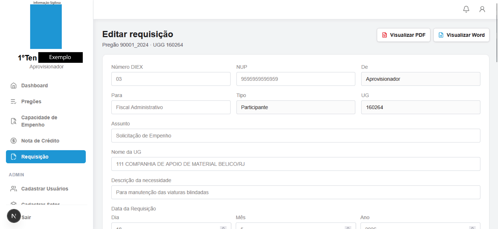
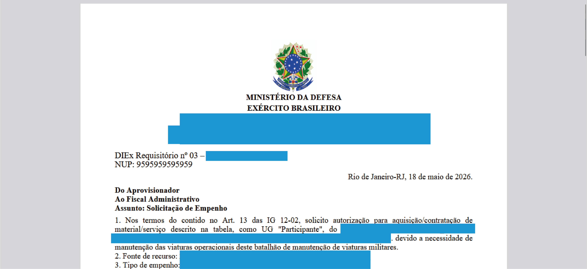
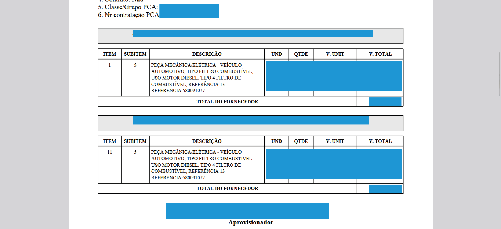
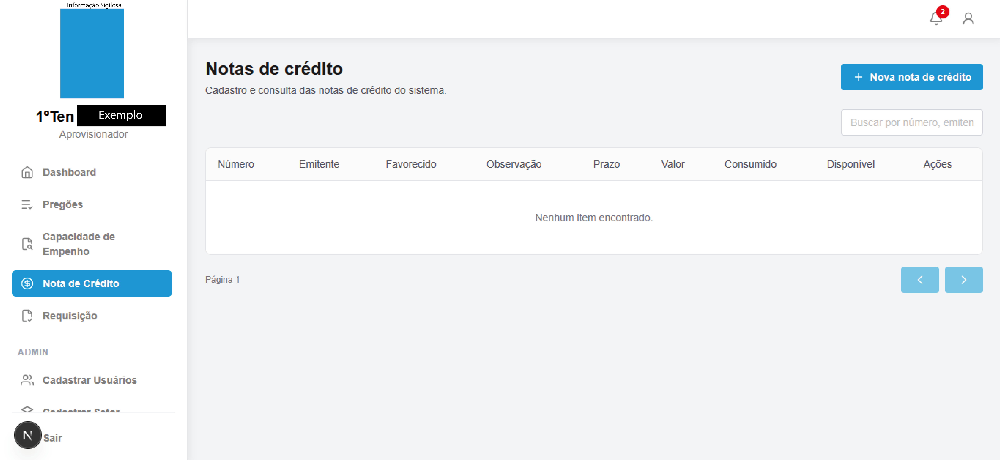
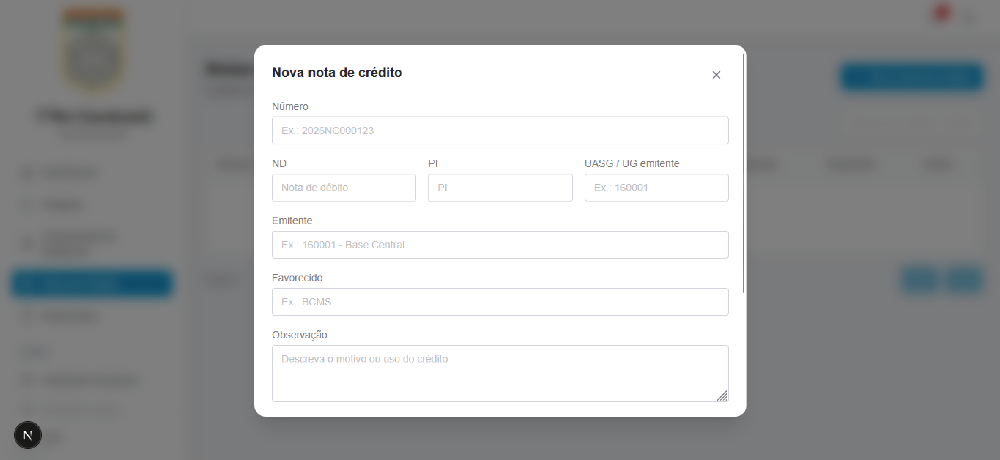
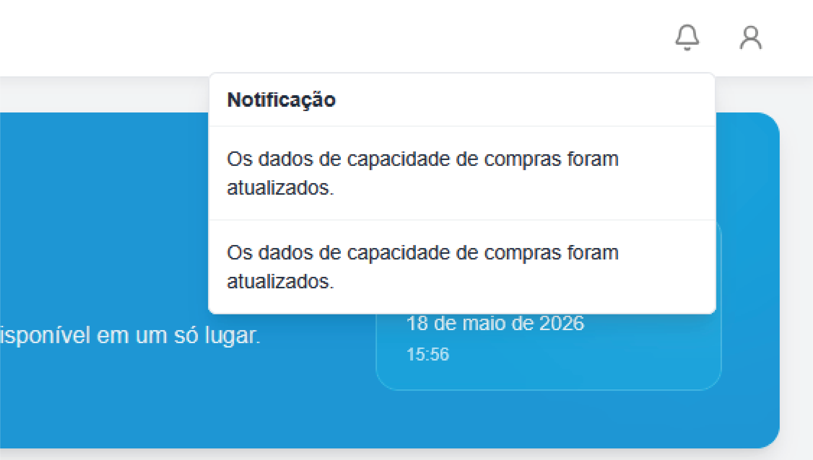
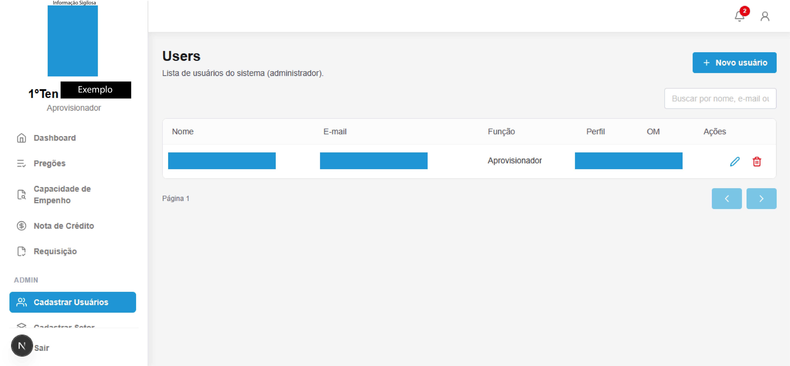
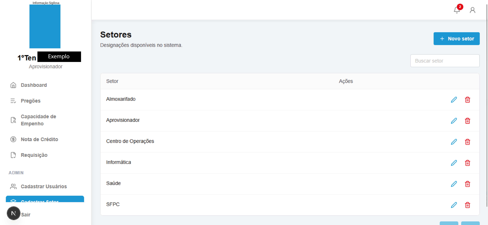

<h1 align="center">SISREQ — Sistema de Requisições</h1>

<p align="center"><strong>Frontend para gestão de requisições, pregões, empenho e notas de crédito</strong></p>

<p align="center">
  <a href="https://nextjs.org/"></a>
  <a href="https://react.dev/"></a>
  <a href="https://www.typescriptlang.org/"></a>
  <a href="https://tailwindcss.com/"></a>
</p>

<!-- [EDITAR] Uma linha sobre você / contexto do projeto -->

Interface web desenvolvida para o fluxo operacional de requisições institucionais, com autenticação, dashboard analítico, geração de documentos (PDF/Word) e painel administrativo.

---

## Índice

- [Sobre o projeto](#sobre-o-projeto)
- [Galeria](#galeria)
  - [Autenticação](#autenticação)
  - [Dashboard](#dashboard)
  - [Pregões](#pregões)
  - [Requisições](#requisições)
  - [Notas de crédito](#notas-de-crédito)
  - [Notificações](#notificações)
  - [Administração](#administração)
- [Funcionalidades](#funcionalidades)
- [Stack](#stack)
- [Destaques técnicos](#destaques-técnicos)
- [Estrutura do projeto](#estrutura-do-projeto)
- [Como executar](#como-executar)
- [Autor](#autor)

---

## Sobre o projeto

O **SISREQ** (Sistema de Requisições) é o painel web usado no dia a dia para registrar e acompanhar **requisições de empenho**, consultar **pregões** e saldos de itens, vincular **notas de crédito** e, no perfil administrador, manter usuários, setores e carga de dados em lote.

Este repositório concentra o **frontend**: rotas autenticadas, formulários validados, tabelas com busca/paginação, exportação de documentos oficiais e notificações em tempo real via WebSocket.

<!-- [EDITAR] Contexto institucional, se quiser mencionar (ex.: BCMS, OM, etc.) -->

---

## Galeria

### Autenticação

Tela de entrada com layout dividido (área institucional + formulário), validação de e-mail/senha e fluxo de sessão JWT.

<p align="left">
  
</p>

---

### Dashboard

Visão inicial com métricas consolidadas: total de requisições, itens com saldo, licitações (pregão + UGG) e crédito disponível. Saudação contextual com data e hora.

<p align="left">
  
</p>

---

### Pregões

Listagem em cards por pregão, com vigência, quantidade de itens, UGG e papel (Participante/Carona). Ações para **gerar requisição** (deep link com `pregao` e `ugg` na URL) e visualizar itens.

<p align="left">
  
</p>

---

### Requisições

#### Listagem

Consulta das requisições cadastradas com busca por NUP, DIEX, tipo etc., paginação e ação para nova requisição.

<p align="left">
  
</p>

#### Criação — itens do pregão

Formulário de nova requisição com tabela de itens do pregão: subitem, unidade, quantidade editável, totais por linha e **total da requisição** recalculado. Integração com notificações no topbar.

<p align="left">
  
</p>

#### Edição

Tela de edição com cabeçalho do pregão/UGG, campos administrativos (DIEX, NUP, de/para, assunto, UG) e atalhos para exportar documentos.

<p align="left">
  
</p>

#### Exportação PDF (oficial)

Geração de PDF no padrão institucional (cabeçalho Exército Brasileiro, solicitação de empenho, NUP, fundamentação e referências normativas).

<p align="left">
  
</p>

<p align="left">
  
</p>

<!-- [EDITAR] Mencione se também exporta Word, se quiser destacar -->

---

### Notas de crédito

CRUD com listagem (número, emitente, favorecido, valores consumido/disponível) e modal de cadastro com campos ND, PI, UASG e observação.

<p align="left">
  
</p>

<p align="left">
  
</p>

---

### Notificações

Sino no topbar com contador de não lidas e painel dropdown; mensagens sobre atualização de dados do sistema (ex.: capacidade de compras).

<p align="left">
  
</p>

---

### Administração

Módulos visíveis apenas para perfil **ADMIN** na sidebar.

#### Usuários

Listagem com busca, cadastro/edição/exclusão e colunas de função, perfil e OM.

<p align="left">
  
</p>

#### Setores (designações)

Gestão de setores como Almoxarifado, Aprovisionador, Informática, SFPC etc.

<p align="left">
  
</p>

#### Atualização de dados em lote

Upload de planilhas Excel/CSV para sincronizar dados do sistema.

<p align="left">
  
</p>

---

## Funcionalidades

| Área | O que faz |
|------|-----------|
| **Login** | Autenticação com Zod + React Hook Form; sessão JWT e refresh automático |
| **Dashboard** | KPIs da API com skeleton de carregamento |
| **Pregões** | Cards por licitação; link direto para criar requisição |
| **Requisição** | Listar, criar (itens do pregão), editar, excluir; totais e validação de linhas |
| **PDF / Word** | Emissão de documentos a partir da requisição salva <!-- [EDITAR] confirme Word se usar --> |
| **Nota de crédito** | CRUD com modal e tabela paginada |
| **Capacidade de empenho** | Consulta tabular <!-- [EDITAR] adicione print se fizer --> |
| **Notificações** | WebSocket + badge e dropdown no topbar |
| **Admin** | Usuários, setores, upload em lote (Excel/CSV) |
| **Perfil** | Dados do usuário logado via contexto global |

---

## Stack

| Camada | Tecnologias |
|--------|-------------|
| Framework | Next.js 16 (App Router), React 19 |
| Linguagem | TypeScript |
| Estilo | Tailwind CSS 4 |
| Formulários | React Hook Form, Zod |
| Tabelas | TanStack Table |
| UX | Lucide React, React Icons, SweetAlert2 |
| API | `fetch` centralizado + camada `app/services/*` |
| Tempo real | WebSocket (gateway de notificações) |

---

## Destaques técnicos

<!-- [EDITAR] Ajuste a lista ao que você mais quer destacar em entrevista -->

- **App Router** com grupos `(auth)` e `(dashboard)`, sidebar com rotas ativas e menu admin condicional por role.
- **Serviços por domínio** (`pregoes`, `requisicao`, `nota-credito`, `auth`, etc.) desacoplados da UI.
- **Cliente HTTP** com fila de refresh de token (`refreshInFlight`) em respostas 401.
- **Context API** (`UserProvider`) para perfil e recarregamento após operações.
- **Componentes reutilizáveis**: `DataTable`, `Modal`, `Input`, `Select`, `FileUpload`.
- **Configuração de colunas** em `*-table-config.tsx` separada da tabela.
- **Deep linking** na criação de requisição: `/requisicao/criar?pregao=&ugg=`.
- **Exportação** de blob PDF/Word com download no browser.

---

## Estrutura do projeto

```text
app/
├── (auth)/login/
├── (dashboard)/
│   ├── dashboard/
│   ├── pregoes/
│   ├── capacidade/
│   ├── notacredito/
│   ├── requisicao/          # listagem, criar, [id]/editar
│   ├── useradmin/
│   ├── designation/
│   └── update/
├── components/layout/       # sidebar, topbar, notificações
├── components/ui/
├── contexts/
├── lib/                     # api, sessão, format
└── services/
docs/screenshots/            # prints deste README
```

---

## Como executar

**Pré-requisitos:** Node.js 20+, API do SISREQ rodando.

```bash
git clone <!-- url-do-repositorio -->
cd sisreq-frontend
npm install
```

Crie `.env.local` na raiz:

```env
NEXT_PUBLIC_API_URL=http://localhost:8080
NEXT_PUBLIC_AUTH_REFRESH_PATH=/auth/refresh
NEXT_PUBLIC_WS_GATEWAY_URL=ws://localhost:8081
```

```bash
npm run dev    # http://localhost:3000
npm run build
npm run lint
```

> Se uma rota nova retornar 404 no dev, pare o servidor, apague a pasta `.next` e rode `npm run dev` de novo.

---

## Autor

- **Autor:** [Yuri Rodrigues Cavalcanti](https://github.com/yuriengcomp99/)
- **LinkedIn:** [https://www.linkedin.com/in/yuri-rodrigues-895287307/](https://www.linkedin.com/in/yuri-rodrigues-895287307/)
- **Frontend:** [Frontend](https://sisreq.vercel.app/login)

---

*SISREQ · Interface focada em produtividade operacional e documentos oficiais*
