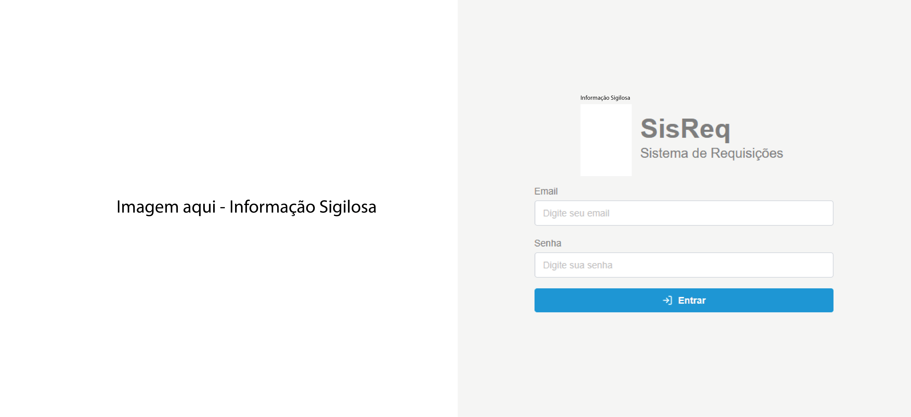
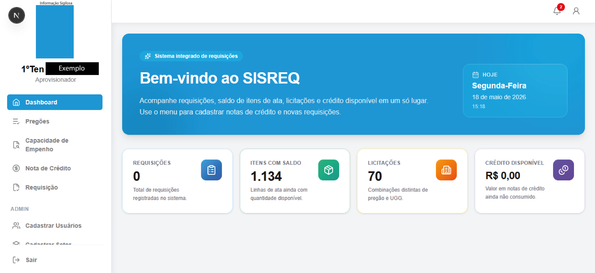
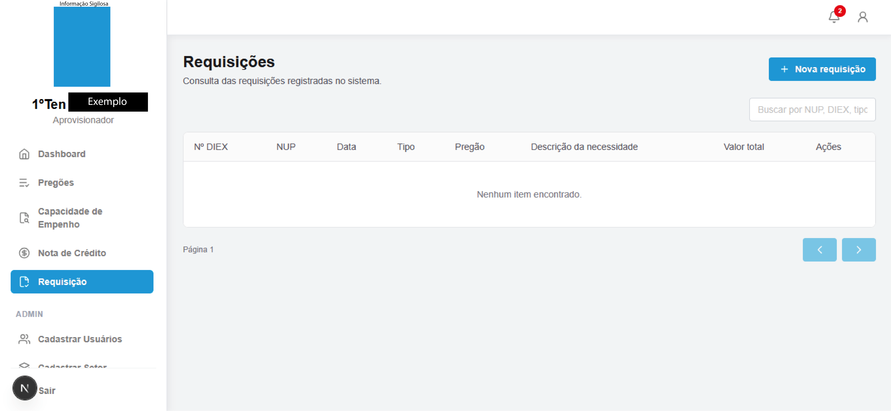
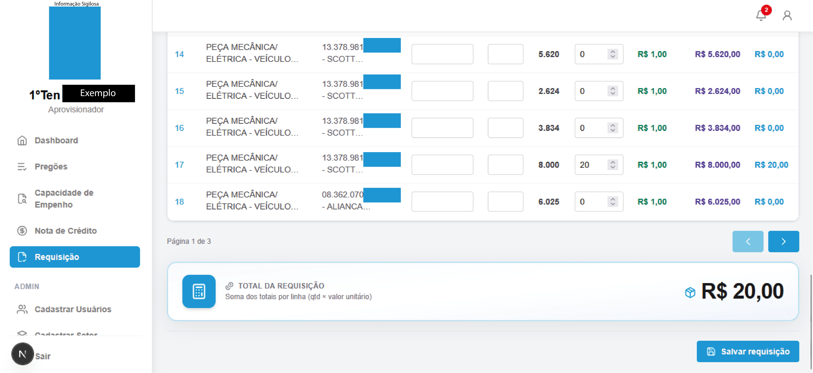
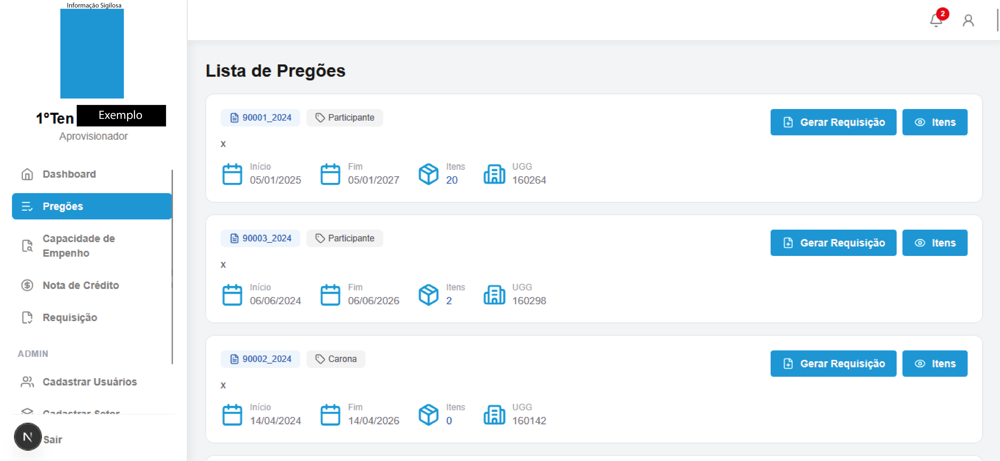
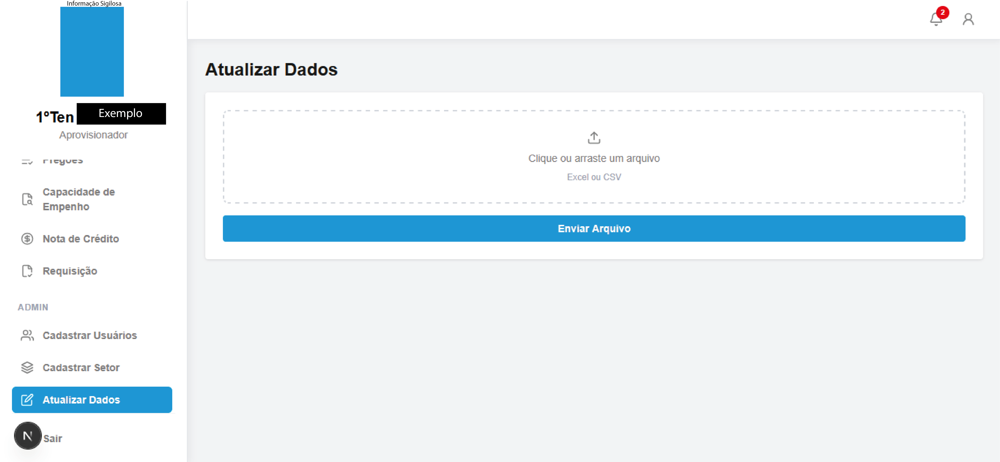

<div align="center">

# SISREQ — Sistema de Requisições

**Frontend web para gestão de requisições, pregões, empenho e notas de crédito**

Interface moderna em **Next.js** e **TypeScript**, integrada a API REST e notificações em tempo real via WebSocket.

<br />

[](https://nextjs.org/)
[](https://react.dev/)
[](https://www.typescriptlang.org/)
[](https://tailwindcss.com/)

</motion>

</motion>

</div>

---

## Sobre o projeto

O **SISREQ** é o painel operacional do fluxo de requisições institucionais: usuários autenticados consultam indicadores no dashboard, gerenciam **pregões**, **capacidade de empenho**, **notas de crédito** e o ciclo completo de **requisições** (listagem, criação e edição). Perfis **admin** têm módulos extras de cadastro de usuários, setores e atualização em lote de dados.

O foco deste repositório é a **camada de apresentação**: componentes reutilizáveis, validação de formulários, tabelas com busca e paginação, feedback visual (skeletons, modais, alertas) e integração segura com o backend (token JWT + refresh automático de sessão).

---

## Galeria

> Substitua cada bloco abaixo pelo print correspondente.  
> Salve as imagens em `docs/screenshots/` com os nomes indicados (mesmos paths usados no markdown).

### 1. Login

**Arquivo:** `docs/screenshots/01-login.png`  
**Sugestão de captura:** tela de login com logo, fundo institucional e campos de e-mail/senha.

<!-- 📸 INSERIR PRINT: login -->


---

### 2. Dashboard

**Arquivo:** `docs/screenshots/02-dashboard.png`  
**Sugestão de captura:** cards de métricas (requisições, valores, itens) e saudação com data/hora.

<!-- 📸 INSERIR PRINT: dashboard -->


---

### 3. Requisições

**Arquivo:** `docs/screenshots/03-requisicoes.png`  
**Sugestão de captura:** listagem com tabela, busca e ação de nova requisição.

<!-- 📸 INSERIR PRINT: requisições -->


---

### 4. Criar / editar requisição

**Arquivo:** `docs/screenshots/04-requisicao-form.png`  
**Sugestão de captura:** formulário de cadastro ou edição com itens da requisição.

<!-- 📸 INSERIR PRINT: formulário de requisição -->


---

### 5. Pregões, empenho ou nota de crédito

**Arquivo:** `docs/screenshots/05-modulos.png`  
**Sugestão de captura:** qualquer um dos módulos operacionais (pregões, capacidade de empenho ou nota de crédito).

<!-- 📸 INSERIR PRINT: módulos operacionais -->


---

### 6. Área administrativa (opcional)

**Arquivo:** `docs/screenshots/06-admin.png`  
**Sugestão de captura:** menu admin visível (usuários, setores ou atualização de dados).

<!-- 📸 INSERIR PRINT: admin -->


---

### 7. Notificações em tempo real (opcional)

**Arquivo:** `docs/screenshots/07-notificacoes.png`  
**Sugestão de captura:** sino de notificações com contador ou painel aberto.

<!-- 📸 INSERIR PRINT: notificações -->


---

## Funcionalidades

| Módulo | Descrição |
|--------|-----------|
| **Autenticação** | Login com validação (Zod + React Hook Form), sessão JWT e refresh transparente |
| **Dashboard** | Resumo de métricas consumidas da API, com loading skeleton |
| **Pregões** | Consulta e gestão de itens vinculados a pregões |
| **Capacidade de empenho** | Visualização tabular da capacidade disponível |
| **Nota de crédito** | CRUD com modais, tabela configurável e estados de carregamento |
| **Requisição** | Listagem, exclusão com confirmação, criação e edição por rota dinâmica |
| **Admin** | Cadastro de usuários e setores, atualização de dados (visível só para `ADMIN`) |
| **Perfil** | Dados do usuário logado via contexto global |
| **Notificações** | WebSocket gateway com contagem de não lidas no topbar |

---

## Stack e ferramentas

| Camada | Tecnologias |
|--------|-------------|
| Framework | Next.js 16 (App Router), React 19 |
| Linguagem | TypeScript |
| Estilo | Tailwind CSS 4 |
| Formulários | React Hook Form, Zod, `@hookform/resolvers` |
| Tabelas | TanStack Table (busca, paginação, colunas tipadas) |
| UX | Lucide React, React Icons, SweetAlert2 |
| Integração | `fetch` centralizado em `app/lib/api.ts`, serviços por domínio |

---

## Destaques técnicos (nível pleno)

- **App Router** com rotas agrupadas `(auth)` e `(dashboard)`, layouts compartilhados e navegação ativa na sidebar.
- **Camada de serviços** desacoplada da UI (`app/services/*`), facilitando manutenção e testes.
- **Cliente HTTP** com renovação de token em fila (`refreshInFlight`), evitando race conditions em múltiplas requisições 401.
- **Context API** (`UserProvider`) para perfil, loading e refresh após operações sensíveis.
- **Componentes de UI** reutilizáveis: `DataTable`, `Modal`, `Input`, `Select`, `FileUpload`, `Button`.
- **Tabelas declarativas** via arquivos `*-table-config.tsx`, separando colunas da renderização.
- **WebSocket** para notificações com reconexão e parsing tipado de mensagens inbound.
- **Acessibilidade e polish**: `aria-label` no menu, skeletons, feedback de erro no login e confirmações destrutivas.

---

## Estrutura do projeto

```
app/
├── (auth)/              # Login e layout público
├── (dashboard)/         # Módulos autenticados
│   ├── dashboard/
│   ├── requisicao/
│   ├── pregoes/
│   ├── capacidade/
│   ├── notacredito/
│   ├── useradmin/
│   ├── designation/
│   └── ...
├── components/
│   ├── layout/          # Sidebar, topbar, notificações
│   └── ui/              # Design system interno
├── contexts/            # Estado global do usuário
├── lib/                 # API, sessão, formatadores
└── services/            # Integração com backend
docs/
└── screenshots/         # Prints para o README
public/                  # Logo, assets estáticos
```

---

## Como executar

**Pré-requisitos:** Node.js 20+, npm (ou pnpm/yarn) e API do SISREQ em execução.

```bash
# Clonar e entrar no projeto
git clone <url-do-repositorio>
cd sisreq-frontend

# Instalar dependências
npm install

# Configurar variáveis (crie .env.local na raiz)
# NEXT_PUBLIC_API_URL=http://localhost:8080
# NEXT_PUBLIC_AUTH_REFRESH_PATH=/auth/refresh
# NEXT_PUBLIC_WS_GATEWAY_URL=ws://localhost:8081

# Desenvolvimento
npm run dev
```

Abra [http://localhost:3000](http://localhost:3000). O fluxo principal começa em `/login`; após autenticação, o usuário é direcionado ao dashboard.

```bash
npm run build   # Build de produção
npm run start   # Servir build
npm run lint    # ESLint
```

---

## Variáveis de ambiente

| Variável | Descrição |
|----------|-----------|
| `NEXT_PUBLIC_API_URL` | URL base da API REST (sem barra final) |
| `NEXT_PUBLIC_AUTH_REFRESH_PATH` | Endpoint de refresh (padrão: `/auth/refresh`) |
| `NEXT_PUBLIC_WS_GATEWAY_URL` | URL do gateway WebSocket para notificações |

---

## Scripts úteis para o README

Depois de salvar os prints em `docs/screenshots/`, confira se os nomes batem com a galeria acima. No GitHub, as imagens aparecem automaticamente nos blocos ``.

Para remover os comentários `<!-- 📸 INSERIR PRINT -->` após inserir todas as imagens, busque por `INSERIR PRINT` no arquivo.

---

## Autor

<!-- Preencha com seu nome, LinkedIn e e-mail profissional -->

**Seu Nome** — Desenvolvedor(a) Frontend Pleno  
[LinkedIn](https://linkedin.com/in/seu-perfil) · [GitHub](https://github.com/seu-usuario) · seu.email@exemplo.com

---

<div align="center">

Projeto desenvolvido como parte do ecossistema **SISREQ** · Interface focada em produtividade e clareza operacional

</motion>

</div>
